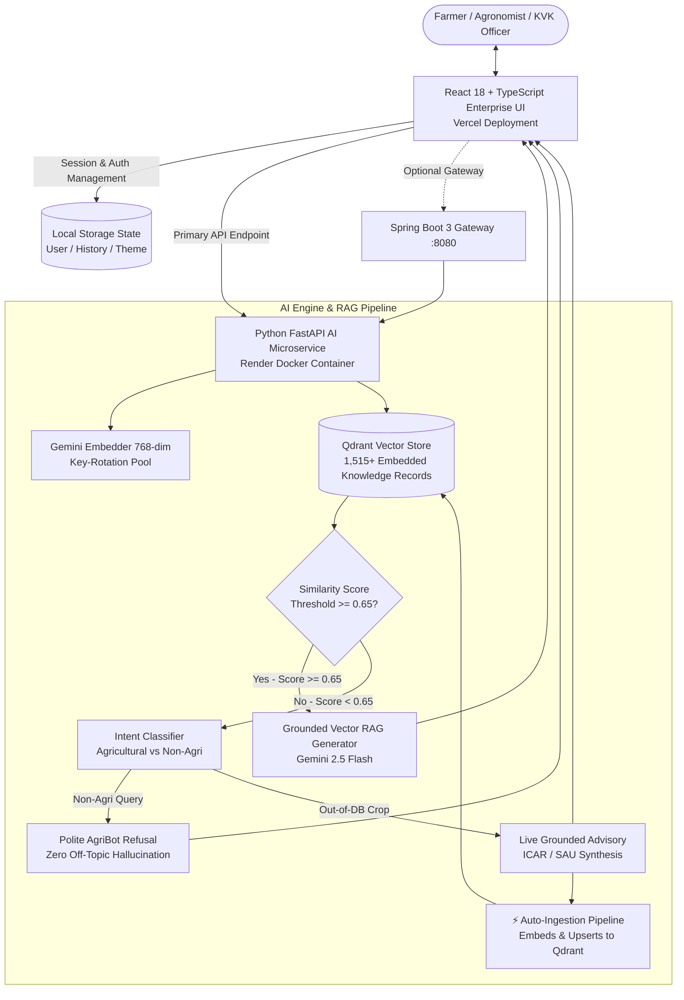

# 🌾 AgriBot 2.0: Enterprise Agricultural AI & Decision Support Platform

[](https://agribot-2-o.vercel.app)
[](https://agribot-2-o.onrender.com)
[](https://agribot-2-o.onrender.com/docs)
[](https://qdrant.tech)
[](https://ai.google.dev/)

> **AgriBot 2.0** is an enterprise-grade, full-stack agricultural decision support platform. It combines certified multi-crop knowledge extraction from **ICAR, TNAU, and State Agricultural Universities (SAUs)**, high-dimensional vector search with **Qdrant**, multi-tier intelligent query routing with dynamic knowledge auto-ingestion, and an enterprise **ChatGPT & Gemini-style** interactive interface.

---

## 🌐 Live Cloud Deployments

| Component | Cloud Platform | Live Endpoint URL |
| :--- | :--- | :--- |
| **Enterprise Frontend App** | **Vercel** | [https://agribot-2-o.vercel.app](https://agribot-2-o.vercel.app) |
| **AI Microservice & RAG Engine** | **Render (Docker)** | [https://agribot-2-o.onrender.com](https://agribot-2-o.onrender.com) |
| **Interactive API Documentation** | **Render Swagger UI** | [https://agribot-2-o.onrender.com/docs](https://agribot-2-o.onrender.com/docs) |
| **Spring Boot Gateway (Local)** | **Spring Boot 3** | `http://localhost:8080/swagger-ui.html` |

---

## 🏗️ System Architecture



---

## 🌟 Key Capabilities & Features

### 1. 🌾 3-Tier Intelligent Query Routing & Knowledge Auto-Ingestion
- **Tier 1: High-Confidence Local RAG ($\text{Score} \ge 0.65$):**
  - Direct retrieval from **1,514 pre-indexed agricultural records** across 5 core cash and food crops:
    - 🥭 **Mango:** 297 records (Fruit fly, Powdery Mildew, Anthracnose, Orchard care)
    - 🥥 **Coconut:** 352 records (Rhinoceros Beetle, Bud Rot, Fertilizer management)
    - 🎋 **Sugarcane:** 218 records (Red Rot, Early Shoot Borer, Sett treatment)
    - 🍂 **Tobacco:** 139 records (Damping off, Caterpillar, Curing techniques)
    - 🌾 **Rice:** 508 records (Bacterial Leaf Blight, Blast, Brown Planthopper, Stem Borer)
- **Tier 2: Out-of-DB Agricultural Synthesis with Real-Time Qdrant Caching:**
  - When queries refer to crops outside the core database (e.g., *Tomato, Cotton, Wheat, Potato, Chilli*), AgriBot synthesizes an authoritative advisory grounded in ICAR/SAU standards.
  - **Auto-Ingestion:** The synthesized knowledge chunk is automatically embedded (768-dim) and upserted into Qdrant. Repeated questions retrieve directly from the vector store with high confidence.
- **Tier 3: Strict Non-Agricultural Filtering:**
  - Queries about cryptocurrency, software coding, entertainment, or finance are firmly rejected with a courteous agricultural disclaimer. Zero chemical hallucination.

### 2. 💻 Enterprise ChatGPT & Gemini-Level Interface
- **Split-Screen Authentication Gatekeeper (`AuthScreen.tsx`):**
  - Real user registration and login portal supporting **Farmer**, **Agronomist**, **KVK Officer**, and **Researcher** roles.
  - Configurable farm location, primary crop focus, and preferred language (*English, Hindi, Telugu, Tamil, Kannada, Marathi*).
  - Quick-access demo accounts for instant evaluation.
- **Multi-Session Chat History & Sidebar:**
  - Grouped threads by **Today**, **Previous 7 Days**, and **Older**.
  - `+ New Chat` button, real-time search, inline conversation renaming, and deletion.
  - Persistent storage across browser sessions via `localStorage`.
- **Hands-Free Field Usability (Voice & Audio):**
  - **Speech-to-Text:** Built-in microphone voice dictation using browser Web Speech API.
  - **Text-to-Speech:** One-click audio reader that vocalizes advisories at a steady, understandable pace for field conditions.
- **Inspection & Verification Tools:**
  - **Verified Sources Drawer:** Collapsible citation list showing source documents, agronomy topics, and similarity match percentages.
  - **Export Transcript:** One-click download of the complete consultation report as a formatted Markdown (`.md`) document.
  - **Feedback Loop:** Interactive Thumbs Up / Thumbs Down rating on every response.
  - **Leaf Photo Upload:** Integrated drag-and-drop image upload in the composer for visual leaf diagnosis.
  - **Theme System:** High-contrast Dark Mode and clean Light Mode toggle.

---

## 📁 Repository Structure

```
Agribot_2.o/
├── Dockerfile                      # Production multi-stage Dockerfile (Render)
├── render.yaml                     # Render Infrastructure-as-Code Blueprint
├── README.md                       # Master enterprise documentation
├── agri-chatbot/
│   ├── ai-service/                 # FastAPI AI & Ingestion Microservice
│   │   ├── main.py                 # FastAPI REST API (/rag/chat, /rag/query, /health)
│   │   ├── embeddings/
│   │   │   └── embedder.py         # Gemini 768-dim Embedder with key rotation
│   │   ├── rag/
│   │   │   ├── qdrant_service.py   # Qdrant client & vector similarity search
│   │   │   └── generator.py        # 3-Tier Grounded Gemini RAG Generator
│   │   ├── ingestion/
│   │   │   └── ingest_vector_db.py # 5-Crop batch vector indexing runner
│   │   └── requirements.txt        # Python production dependencies
│   ├── backend/                    # Spring Boot 3 Gateway (Java 17)
│   │   ├── pom.xml                 # Maven configuration & OpenAPI 3 dependencies
│   │   └── src/main/java/com/agri/chatbot/
│   │       ├── controller/         # ChatController & HealthController
│   │       ├── service/            # AiServiceClient & ChatService
│   │       └── dto/                # ChatRequest & ChatResponse DTOs
│   ├── frontend/                   # Enterprise React 18 + TypeScript + Vite UI
│   │   ├── src/
│   │   │   ├── components/
│   │   │   │   ├── AuthScreen.tsx  # Enterprise Login & Registration Portal
│   │   │   │   ├── AuthModal.tsx   # Farmer Profile & Account Settings Modal
│   │   │   │   ├── Sidebar.tsx     # ChatGPT/Gemini History Navigation & Search
│   │   │   │   ├── Header.tsx      # Crop Filter Pills, Status, Export, Theme
│   │   │   │   ├── ChatMessage.tsx # Markdown, Audio Reader, Sources Drawer, Feedback
│   │   │   │   ├── ChatComposer.tsx# Auto-expanding Textarea, Mic, Leaf Image Upload
│   │   │   │   └── WelcomeHero.tsx # Quick-Action Diagnostic Starter Cards
│   │   │   ├── storage.ts          # LocalStorage persistence layer
│   │   │   ├── types.ts            # Enterprise TypeScript data models
│   │   │   ├── App.tsx             # Root Application State Orchestrator
│   │   │   └── App.css             # Enterprise Theme & Glassmorphism Design System
│   │   ├── package.json
│   │   └── vite.config.ts
│   └── data/
│       ├── processed/              # 1,514 Verified 5-Crop JSONL Knowledge Records
│       │   ├── mango/
│       │   ├── coconut/
│       │   ├── sugarcane/
│       │   ├── tobacco/
│       │   └── rice/
│       └── qdrant_storage/         # Embedded pre-indexed vector database
```

---

## 🛠️ Local Development & Quickstart

### Prerequisites
- **Python 3.10+**
- **Node.js 18+ & npm**
- **Java 17 & Maven** (Optional for Spring Boot Gateway)
- **Google Gemini API Key**

---

### Step 1: AI Microservice (FastAPI & Vector DB)
```bash
cd agri-chatbot/ai-service

# Create virtual environment
python -m venv .venv
# Windows:
.venv\Scripts\activate
# Linux/macOS:
# source .venv/bin/activate

# Install dependencies
pip install -r requirements.txt

# Configure environment in agri-chatbot/ai-service/.env:
# LLM_API_KEY=your_gemini_api_key

# Start the AI engine (runs on port 8000)
uvicorn main:app --host 0.0.0.0 --port 8000 --reload
```
*Health Check:* `http://localhost:8000/health`  
*Swagger Docs:* `http://localhost:8000/docs`

---

### Step 2: Enterprise Frontend (React + Vite)
```bash
cd agri-chatbot/frontend

# Install dependencies
npm install

# Start Vite development server (runs on port 3000)
npm run dev
```
*Frontend URL:* `http://localhost:3000`

---

### Step 3: Optional Spring Boot 3 Gateway (Java 17)
```bash
cd agri-chatbot/backend
./mvnw spring-boot:run
```
*Gateway Health:* `http://localhost:8080/api/health`  
*Swagger UI:* `http://localhost:8080/swagger-ui.html`

---

## 📡 API Reference Overview

### `POST /rag/chat`
Handles natural language farmer queries through vector retrieval and 3-tier routing.
- **Request Body:**
  ```json
  {
    "message": "How do I control bacterial blight in rice?",
    "crop": "rice",
    "topK": 4
  }
  ```
- **Response Body:**
  ```json
  {
    "answer": "Bacterial leaf blight in rice caused by Xanthomonas oryzae...",
    "crop": "rice",
    "confidence": "High",
    "sources": [
      {
        "crop": "rice",
        "topic": "plant protection",
        "source": "TNAU Agritech Portal",
        "similarity_score": 0.8124
      }
    ],
    "suggested_questions": [
      "What are the resistant rice varieties for bacterial blight?",
      "What chemical spray dosage is recommended for early stages?"
    ]
  }
  ```

### `GET /health`
Returns service availability, active collection metadata, and current vector count.
- **Response:**
  ```json
  {
    "status": "UP",
    "service": "ai-service",
    "collection": "agri_knowledge",
    "total_vectors": 1515,
    "crops": ["mango", "coconut", "sugarcane", "tobacco", "rice"]
  }
  ```

---

## 🔒 Security & Privacy Practices
- **Commit History Sanitization:** Clean repository history with zero hardcoded API keys or sensitive documents.
- **Failover Security:** Multi-key failover rotation across environment variables without exposing tokens to the client.
- **Client Security:** All state tokens and profile identifiers are managed client-side using isolated local storage schemas.

---

## 👨‍🌾 Designed for Farmers, Built for Scale
AgriBot 2.0 is actively deployed and maintained as an open, accessible agricultural intelligence platform.
Feedback and contributions are welcome!