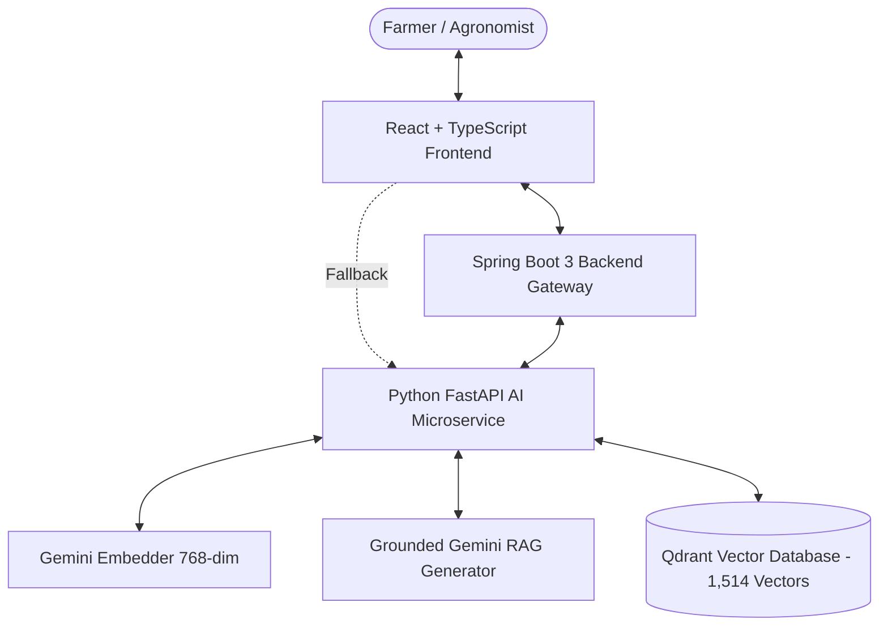

# Agribot 2.0: AI-Powered Agricultural Assistant & Knowledge Platform

> A production-ready, full-stack agricultural decision support platform built for farmers. It combines an adaptive multi-format web and document crawler, structured factual knowledge extraction powered by Gemini, high-dimensional vector search with Qdrant, and an interactive full-stack chat interface.

---

## 🌾 Project Vision & Overview
Agribot 2.0 is designed to bridge the gap between complex agricultural science and actionable farmer advisory. Agricultural information in India and globally is distributed across diverse formats: static agronomy portals, university tables (TNAU, ICAR), interactive modal-based web applications, research publications, and PDF package of practices.

Agribot 2.0 ingests, validates, segments, and indexes this multi-modal data into structured, source-grounded knowledge objects—ensuring zero hallucination, strict adherence to scientific agronomy, and high-accuracy retrieval across **5 core crops**:
1. 🥭 **Mango**
2. 🥥 **Coconut**
3. 🎋 **Sugarcane**
4. 🍂 **Tobacco**
5. 🌾 **Rice**

---

## 🏗️ System Architecture



### Architectural Tiers:
1. **Frontend (`agri-chatbot/frontend`):** Modern, accessible React 18 + TypeScript + Vite UI with interactive crop filter pills (Mango, Coconut, Sugarcane, Tobacco, Rice), citations display with match scores, and clickable suggested follow-up questions.
2. **Backend Gateway (`agri-chatbot/backend`):** Spring Boot 3 (Java 17) REST API serving as a secure gateway, managing sessions, CORS, and routing queries to AI microservices.
3. **AI Microservice (`agri-chatbot/ai-service`):** Python FastAPI service providing vector search (`/rag/query`), grounded RAG generation (`/rag/chat`, `/rag/generate`), and embedding endpoints.
4. **Vector Database (Qdrant):** High-speed vector similarity engine indexing 1,514 multi-crop knowledge vectors with cosine distance.

---

## 🚀 Accomplishments & Current Status (Steps 1 – 4 Complete)

### ✅ Step 1: Core Full-Stack Infrastructure
- Connectivity verified between React frontend, Spring Boot backend, FastAPI AI engine, and Qdrant.
- Health monitoring endpoints implemented (`/api/health`, `/health`).
- Dockerized deployment configured with multi-stage builds.

### ✅ Step 2: Multi-Crop Knowledge Extraction (All 5 Crops Complete)
A generalized, resilient ingestion engine processed and verified all agricultural sources into clean JSONL records:
- 🥭 **Mango:** 297 verified knowledge records | 163 images
- 🥥 **Coconut:** 352 verified knowledge records | 211 images
- 🎋 **Sugarcane:** 218 verified knowledge records | 826 images
- 🍂 **Tobacco:** 139 verified knowledge records | 67 images
- 🌾 **Rice:** 508 verified knowledge records | 2,322 images
- **Total Knowledge Base:** **1,514 verified knowledge records** stored in `agri-chatbot/data/processed/`.

### ✅ Step 3: Vector Database Ingestion (Qdrant)
- **Embedding Model:** `models/gemini-embedding-001` with 768 output dimensions.
- **Failover Rotation:** Multi-key rotation across 23 configured Gemini API keys.
- **Collection `agri_knowledge`:** All 1,514 records across all 5 crops successfully embedded and indexed with metadata payloads (crop, topic, title, source_file, text).
- **Retrieval Engine:** Sub-second semantic search with cosine similarity scores >0.70.

### ✅ Step 3.5: Grounded RAG Response Generation
- **Grounded Generator (`GeminiGenerator`):** Formulates clear, actionable advice strictly based on retrieved agricultural context chunks.
- **Guardrails:** Prevents hallucinated chemicals and dosages; prompts farmers to consult local KVK officers if context is insufficient.
- **Instant Failover:** Zero-wait failover on API quota exhaustion or model unavailability.
- **Rich Output:** Natural language response, verified source citations, and dynamic follow-up questions.

### ✅ Step 4: Full-Stack Integration
- **Spring Boot Client (`AiServiceClient.java`):** Connects `/api/chat` to FastAPI `/rag/chat`, passing crop filters and returning structured DTOs.
- **React Frontend UI (`App.tsx`):**
  - Interactive crop filter pills (🌱 All Crops, 🥭 Mango, 🥥 Coconut, 🎋 Sugarcane, 🍂 Tobacco, 🌾 Rice).
  - Formatted markdown rendering for remedies, symptoms, and dosages.
  - Source citation chips showing matched crop, topic, and match percentages.
  - Interactive suggested follow-up chips.
  - Dual-backend resilience: Tries Spring Boot (:8080) and seamlessly falls back to FastAPI (:8000) if gateway is offline.

---

## 📂 Project Directory Structure

```
Agribot_2.o/
├── .gitignore                      # Strict secret & build ignore rules
├── README.md                       # Project documentation
├── agri-chatbot/
│   ├── .env.example                # Global environment template
│   ├── docker-compose.yml          # Container configuration for all services
│   ├── ai-service/                 # FastAPI AI & Ingestion Microservice
│   │   ├── main.py                 # FastAPI application with /rag/chat & /rag/query
│   │   ├── embeddings/             # Gemini 768-dim Embedder with key rotation
│   │   │   └── embedder.py
│   │   ├── rag/                    # Vector DB & LLM Generation
│   │   │   ├── qdrant_service.py   # Qdrant client & semantic search
│   │   │   └── generator.py        # Grounded Gemini RAG response generator
│   │   ├── ingestion/              # Ingestion & batch vector DB runner
│   │   │   └── ingest_vector_db.py # 5-crop vector indexing runner
│   │   └── requirements.txt
│   ├── backend/                    # Spring Boot 3 Java Gateway
│   │   ├── pom.xml
│   │   └── src/main/java/com/agri/chatbot/
│   │       ├── controller/         # ChatController & HealthController
│   │       ├── service/            # AiServiceClient & ChatService
│   │       └── dto/                # ChatRequest & ChatResponse
│   ├── frontend/                   # React 18 + TypeScript + Vite UI
│   │   ├── src/
│   │   │   ├── App.tsx             # Interactive Farmer Chatbot UI
│   │   │   └── App.css             # Agricultural styling & responsive layout
│   │   └── package.json
│   └── data/
│       ├── processed/              # Verified 5-crop JSONL datasets (1,514 records)
│       │   ├── mango/
│       │   ├── coconut/
│       │   ├── sugarcane/
│       │   ├── tobacco/
│       │   └── rice/
│       └── qdrant_storage/         # Local Qdrant vector index (gitignored)
```

---

## 🛠️ Quickstart & Local Setup

### 1. AI Service & Vector DB (Python FastAPI)
```bash
cd agri-chatbot/ai-service
# Configure your Gemini API keys in .env
python -m venv .venv
.venv\Scripts\activate
pip install -r requirements.txt

# Run the FastAPI AI service
uvicorn main:app --host 0.0.0.0 --port 8000 --reload
```

### 2. Spring Boot Gateway (Java 17)
```bash
cd agri-chatbot/backend
./mvnw spring-boot:run
```

### 3. React Frontend (Vite)
```bash
cd agri-chatbot/frontend
npm install
npm run dev
```

Open `http://localhost:3000` to interact with AgriBot 2.0!